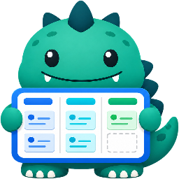

# Kaijura

<p align="center">
  
</p>

Kaijura is a Windows 11 desktop app for reading Jira Server/Data Center issues and managing a local kanban view without changing Jira.

## Stack

- .NET 10
- WPF shell
- WebView2 HTML/CSS/JavaScript UI
- Jira REST API with Bearer personal access token
- Local JSON state under `%LOCALAPPDATA%\Kaijura`
- Token encryption through Windows DPAPI CurrentUser
- Velopack packaging and updates from GitHub Releases

## Development

```powershell
dotnet restore Kaijura.slnx
dotnet build Kaijura.slnx
dotnet test Kaijura.slnx
dotnet run --project Kaijura.App
```

## Release Build

```powershell
dotnet publish Kaijura.App/Kaijura.App.csproj --configuration Release --runtime win-x64 --self-contained true --output publish
```

Tagging `vX.Y.Z` runs the GitHub Actions workflow that publishes a Velopack release.
